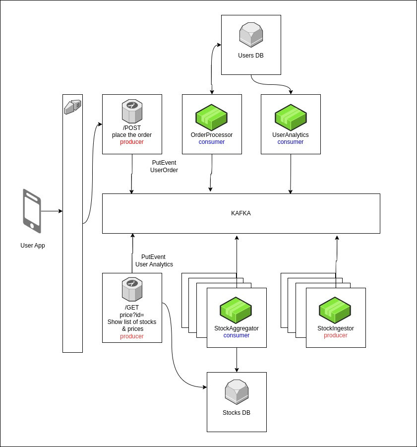
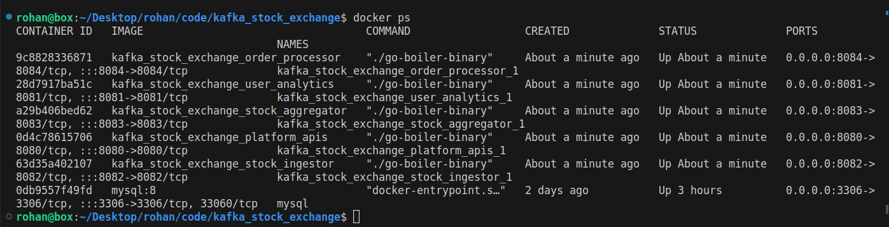
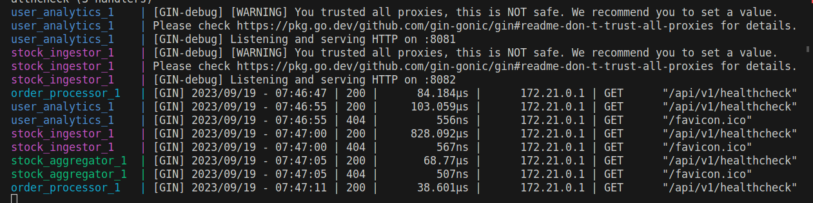
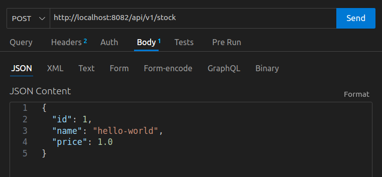
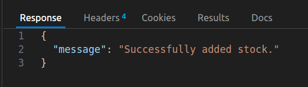
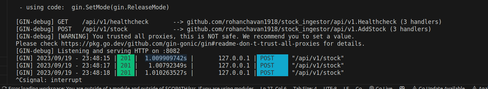
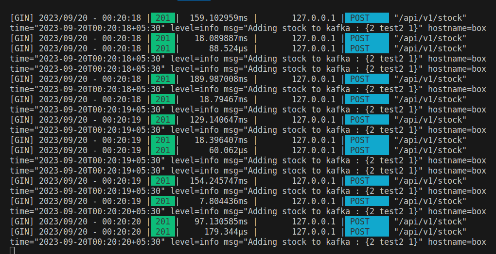
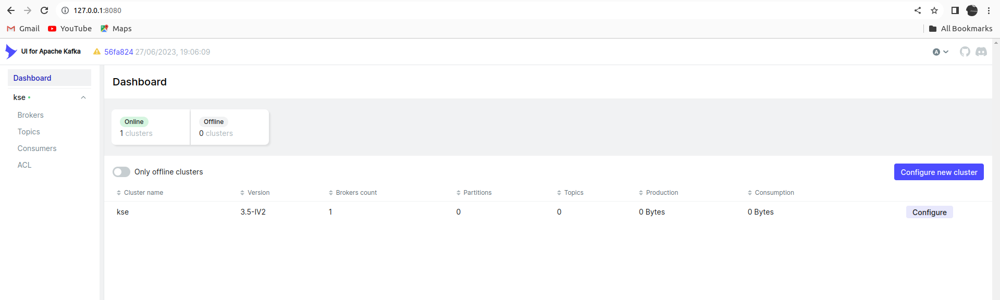
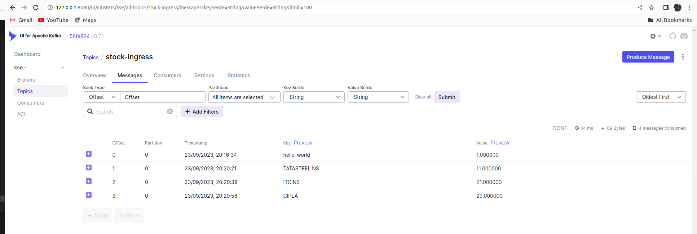

# Kafka Stock Exchange Blog

## Summary

In this blog post, we'll explore the creation of microservices in Go integrated with Kafka, all within the context of our exciting project, the 'Kafka Stock Exchange.' Within this project, we've meticulously designed five distinct services, each playing a pivotal role within the dynamic stock exchange environment:

- Platform APIs
- UserAnalytics
- Stock Ingestor
- Stock Aggregator
- Order Processor



## Setup

1. Cloned the boiler plate and installed the dependencies.
    [(https://github.com/rohanchavan1918/go-boiler)](https://github.com/rohanchavan1918/go-boiler)

2. In this tutorial, we're dealing with multiple services that we want to manage collectively. To simplify the process, we'll harness the power of Docker Compose. We'll craft a Docker Compose file that allows us to start or stop all the services simultaneously. However, it's important to note that each service comes with its own multi-stage Dockerfile and Docker Compose file (included in the boilerplate). This means we can also kickstart or halt individual services separately, providing flexibility during the development phase.

In the below image we can see that the master docker compose has started all the docker containers running on different ports.



Containers are also serving as expected.



Now that we have our services up and running, let's setup kafka and zookeeper. I will be using docker images for the same. We have created a folder called kafka-zk in the root directory of the project. This folder contains a docker-compose.yml file which will start the kafka and zookeeper containers. We are keeping this file so that we can start/stop the kafka containers as and when required.

## Stock Ingestor

With the initial setup done, lets code the stock ingestor service. The stock ingestor service is a producer service which is responsible for ingesting the stock data using an endpoint and then pushing it to kafka so that stock Agreegator service can consume it.

The project structure for the stock ingestor service is as follows:

```sh
.
├── api
│   ├── routes.go
│   ├── server.go
│   └── v1
│       ├── handlers.go
│       └── routes.go
├── cmd
│   └── root_cmd.go
├── conf
│   ├── config.go
│   ├── db.go
│   ├── fluent.go
│   ├── kafka.go
│   ├── logging.go
│   └── redis.go
├── config
│   └── config.json
├── docker-compose.yml
├── Dockerfile
├── go.mod
├── go.sum
├── internal
│   └── internal.go
├── main.go
├── readme.md
├── stocks
│   └── stocks.go
└── utils
    └── utils.go
```

Most of the files are included in the boilerplate. We will be adding the following files:
    stocks -> stocks.go
    api -> v1 -> handlers.go
    conf -> kafka.go

### handlers.go

We have added a handler function `AddStock` to handle the stock ingestor endpoint. The handler function will read the stock data from the request body and then push it to kafka.

```go
func AddStock(c *gin.Context) {
    var stock stocks.Stock

    if err := c.ShouldBindJSON(&stock); err != nil {
        c.JSON(http.StatusBadRequest, gin.H{
        "error": err.Error(),
        })
        return
    }

    if err := stock.Validate(); err != nil {
        c.JSON(http.StatusBadRequest, gin.H{
            "error": err.Error(),
        })
        return
    }

    if err := stocks.AddToKafka(&stock); err != nil {
        utils.LogInfo("Failed to add stock to kafka : %s", err)
        c.JSON(http.StatusBadRequest, gin.H{
        "message": "Failed to add stock.",
        })
        return
    }

    c.JSON(http.StatusCreated, gin.H{
    "message": "Successfully added stock.",
    })
    return

}

```

Now lets register this route in the routes.go file. We will be adding the following line to the SetupRoutes function.

```go

func SetupRoutes(r *gin.RouterGroup) {
    v1Group := r.Group("/v1")
    v1Group.GET("/healthcheck", Healthcheck)
    v1Group.POST("/stock", AddStock)
}

```

Below is the code for stocks.go

```go

type Stock struct {
    ID    int64   `json:"id"`
    Name  string  `json:"name"`
    Price float64 `json:"price"`
}

func (s *Stock) Validate() error {
    if s.Name == "" {
        return errors.New("Name cannot be empty")
    }
    if s.ID == 0 {
        return errors.New("ID cannot be empty")
    }

    if s.Price < 0 || math.IsNaN(s.Price) || math.IsInf(s.Price, 0) {
        return errors.New("Price must be a non-negative number")
    }
    return nil
}

```

Now lets run the stock_ingestor and test the endpoint using postman.




But there is one issue, Every api call is taking 1s to complete which not ideal in a real world scenario operating at scale. This is because we are pushing the data to kafka synchronously..



We can easily optimize this if we implement a worker pool which listens to a channel and push the data to kafka asynchronously. Lets refactor the code to implement this.

Updated files

`api/v1/handler.go > AddStock` :

After validating the stock price we will push the stock to a channel `StockChannel` which is defined in the stocks package.

```go
func AddStock(c *gin.Context) {
	var stock stocks.Stock
	if err := c.ShouldBindJSON(&stock); err != nil {
		c.JSON(http.StatusBadRequest, gin.H{
			"error": err.Error(),
		})
		return
	}

	if err := stock.Validate(); err != nil {
		c.JSON(http.StatusBadRequest, gin.H{
			"error": err.Error(),
		})
		return
	}

    // Push the stock to the channel
	stocks.StockChannel <- stock

	c.JSON(http.StatusCreated, gin.H{
		"message": "Successfully added stock.",
	})
	return
}
```

`stocks/stocks.go` :

We have introduced a new channel `StockChannel` which will be used to push the stock data to kafka asynchronously. The function above will pass the stock data to this channel and the KafkaStockWriterWorker will listen to this channel and push the data to kafka.

```go
type Stock struct {
	// Stock model
	ID    int64   `json:"id"`
	Name  string  `json:"name"`
	Price float64 `json:"price"`
}

var StockChannel = make(chan Stock)

func KafkaStockWriterWorker(stockChannel <-chan Stock, wg *sync.WaitGroup) {
	// Worker to write stock to kafka
	defer wg.Done()
	for {
		stock := <-stockChannel
		utils.LogInfo("Adding stock to kafka : %v", stock)
		err := AddToKafka(&stock)
		if err != nil {
			utils.LogInfo("Failed to add stock to kafka : %s", err)
		}
	}
}

func (s *Stock) Validate() error {
	// validate stock to database
	if s.Name == "" {
		return errors.New("Name cannot be empty")
	}
	if s.ID == 0 {
		return errors.New("ID cannot be empty")
	}

	if s.Price < 0 || math.IsNaN(s.Price) || math.IsInf(s.Price, 0) {
		return errors.New("Price must be a non-negative number")
	}
	return nil
}

func (s *Stock) GetPriceByte() (string, error) {
	// s.Price is float64 which cant be converted directly to []byte,
	// so we use convert it into string and then to []byte

	price := fmt.Sprintf("%f", s.Price)
	if price == "" {
		return "", errors.New("Price cannot be empty")
	}
	return price, nil
}

func AddToKafka(stock *Stock) error {
	// Add stock to kafka
	price, err := stock.GetPriceByte()
	if err != nil {
		return err
	}

	km := kafka.Message{
		Key:   []byte(stock.Name),
		Value: []byte(price),
	}

	w, err := conf.AppConfig.KafkaConfig.GetProducer()
	if err != nil {
		return err
	}

	err = w.WriteMessages(context.Background(), km)
	if err != nil {
		return err
	}

	return nil
}

```

We need to start these workers in goroutines. We will be adding the following lines to the `api/server.go` file.

```go
func RunServer(config *conf.Config) {
	r := gin.Default()
	SetupRoutes(r)
	dbConn := conf.GetDBConnection(&config.DB)
	err := dbConn.Ping()
	if err != nil {
		utils.AlertAndPanic(err)
	}

	// Once DB Connection is validated, add it to the global connections
	conf.AppConnections.DB = dbConn

	// Check for Kafka connections
	writer, err := conf.AppConfig.KafkaConfig.GetProducer()
	if err != nil {
		utils.AlertAndPanic(err)
	}

	conf.AppConnections.KafkaWriter = writer
	var wg sync.WaitGroup

	// Spawn KafkaStockWriterWorker goroutines
	for i := 0; i < 5; i++ {
		wg.Add(1)
		go stocks.KafkaStockWriterWorker(stocks.StockChannel, &wg)
	}
	defer close(stocks.StockChannel)
	defer wg.Wait()

	port := fmt.Sprintf(":%s", strconv.Itoa(int(conf.AppConfig.Port)))
	r.Run(port)
}
```

we have also made changes to kafka.go, this is how
`conf/kafka.go` file looks now.

```go
type KafkaConfig struct {
	Host  string `viper:"string" validate:"required" mapstructure:"kafka_host"`
	Port  int64  `viper:"string" validate:"required" mapstructure:"kafka_port"`
	Topic string `viper:"string" validate:"required" mapstructure:"topic"`
}

func (c *KafkaConfig) getKafkaHost() string {
	// Get a kafka producer from the config
	if c.Host == "" || c.Port == 0 || c.Topic == "" {
		return ""
	}
	return fmt.Sprintf("%s:%d", c.Host, c.Port)
}

func (c *KafkaConfig) GetProducer() (*kafka.Writer, error) {
	// Get a kafka producer from the config

	kafkaHost := c.getKafkaHost()
	if kafkaHost == "" {
		err := errors.New("Kafka host, port or topic cannot be empty")
		return nil, err
	}
	w := kafka.NewWriter(kafka.WriterConfig{
		Brokers: []string{kafkaHost},
		Topic:   c.Topic,
	})
	return w, nil
}

```

Now lets run the stock_ingestor and test the endpoint using postman.



We can see that the response time has reduced drastically.
To confirm that the data is being pushed to kafka we can use a tool called as [kafkaui](https://github.com/provectus/kafka-ui). Lets update the `docker-compose` file in the `kafka-zk` folder.

```yml
version: '2'
services:
  zookeeper:
    image: confluentinc/cp-zookeeper:latest
    environment:
      ZOOKEEPER_CLIENT_PORT: 2181
      ZOOKEEPER_TICK_TIME: 2000
    ports:
      - 22181:2181
  
  kafka:
    image: confluentinc/cp-kafka:latest
    depends_on:
      - zookeeper
    ports:
      - 29092:29092
    environment:
      KAFKA_BROKER_ID: 1
      KAFKA_ZOOKEEPER_CONNECT: zookeeper:2181
      KAFKA_ADVERTISED_LISTENERS: PLAINTEXT://kafka:9092,PLAINTEXT_HOST://localhost:29092
      KAFKA_LISTENER_SECURITY_PROTOCOL_MAP: PLAINTEXT:PLAINTEXT,PLAINTEXT_HOST:PLAINTEXT
      KAFKA_INTER_BROKER_LISTENER_NAME: PLAINTEXT
      KAFKA_OFFSETS_TOPIC_REPLICATION_FACTOR: 1
  
  kafka-ui:
    container_name: kafka-ui
    image: provectuslabs/kafka-ui:latest
    ports:
      - 8080:8080
    environment:
      DYNAMIC_CONFIG_ENABLED: 'true'
    volumes:
      - ./config.yml:/etc/kafkaui/dynamic_config.yaml
    depends_on:
      - kafka
```

This docker file requires a `config.yml` file which contains the kafka connection details. Lets create a `config.yml` file in the `kafka-zk` folder.

```yml
kafka:
  clusters:
    -
      name: kse
      bootstrapServers: kafka:9092
```

Now lets run the docker-compose file in the `kafka-zk` folder. And open the kafka-ui in the browser which should be running on port 8080.



when we go to the topic we have created `stock-ingress` we can see that the data is being pushed to kafka.


With this we can conclude the stock ingestor service.

## Stock Aggregator

The stock aggregator service is a consumer service which is responsible for consuming the stock data from kafka and then storing it in the database. The project structure for the stock aggregator service is as follows:

```sh


```